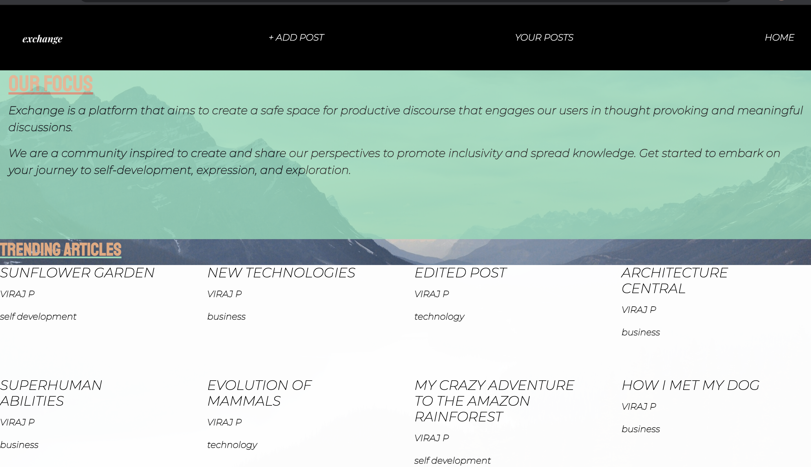
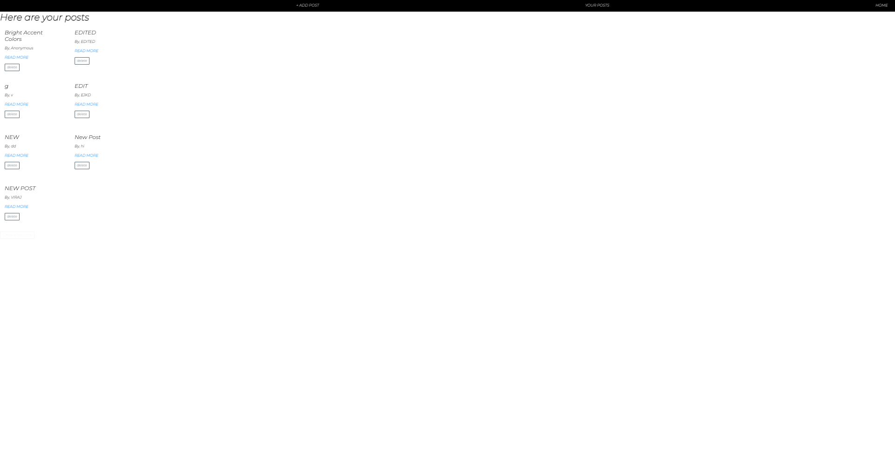
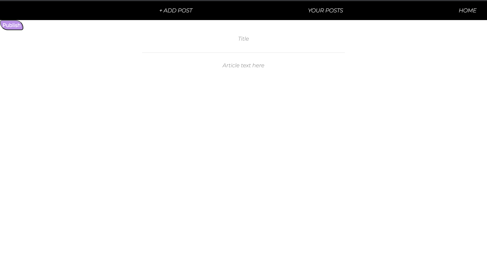
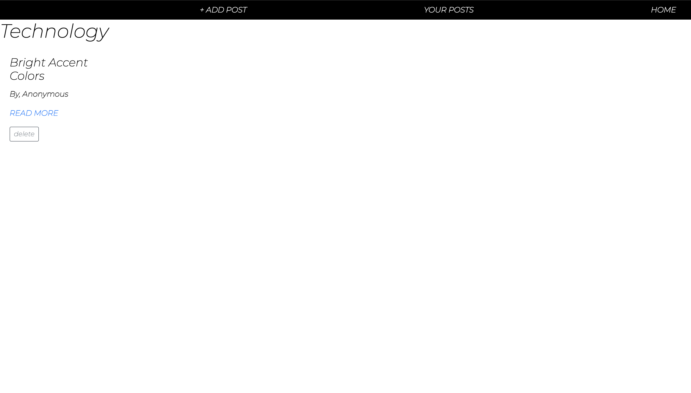

# Exchange
### Exchange is a CRUD journal/blogging website made for users to share their knowledge to the exchange community and engage in productive discourse! 

## Technologies 
* HTML5
* CSS3
* JavaScript
* Express
* MongoDB
* Mongoose
* Node
* Bootstrap

# ERD

# WIREFRAME

## Getting Started 

[Click here]( https://crud-journal-app-1.herokuapp.com/posts ) to get started

## Future Enhancements

* Add user data model and authentication
* Create templates for posts
* Add a user profile section and a "featured creator" section to homepage
